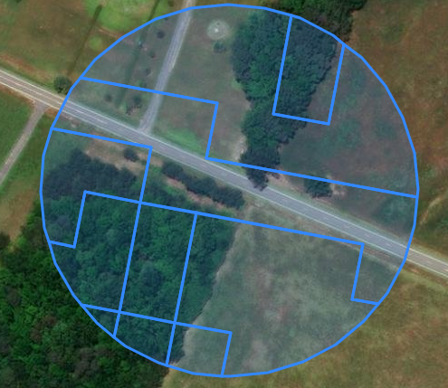

### [Cloud Optimized GeoTiff](https://www.cogeo.org/)

Download and extract raster file to /tmp:

    curl https://s3-us-west-2.amazonaws.com/mrlc/nlcd_2019_land_cover_l48_20210604.zip --output tmp/nlcd_2019_land_cover_l48_20210604.zip
    unzip tmp/nlcd_2019_land_cover_l48_20210604.zip -d tmp

Create a Cloud Optimized GeoTiff with [gdal](https://gdal.org/):

    docker-compose run --rm cmd gdalwarp -t_srs EPSG:4326 -of COG -co COMPRESS=LZW -dstnodata 0 /data/nlcd_2019_land_cover_l48_20210604.img /data/nlcdlc2019cogeo.tif

To view in QGIS:

    Layer -> Add Layer -> Add Raster Layer
    Source Type: Protocol: HTTPS(S),cloud,etc.
    URI: http://localhost/cog/nlcdlc2019cogeo.tif

[Check it out!](http://localhost:8080/index.html)

### [MBTiles](https://docs.mapbox.com/help/glossary/mbtiles/)

Download and merge some rasters:

    curl https://s3-us-west-2.amazonaws.com/fs.usda.rds/RDS-2020-0016/RDS-2020-0016_California.zip --output tmp/RDS-2020-0016_California.zip
    curl https://s3-us-west-2.amazonaws.com/fs.usda.rds/RDS-2020-0016/RDS-2020-0016_Nevada.zip --output tmp/RDS-2020-0016_Nevada.zip
    unzip tmp/RDS-2020-0016_California.zip -d tmp
    unzip tmp/RDS-2020-0016_Nevada.zip -d tmp

Merge them together, adding alpha channel to mask no data value:

    gdalbuildvrt tmp/FLEP8.vrt tmp/FLEP8_CA.tif tmp/FLEP8_NV.tif
    gdalwarp -dstalpha tmp/FLEP8.vrt tmp/FLEP8.tif -co COMPRESS=LZW

Create mbtiles and overviews:

    gdal_translate -scale tmp/FLEP8.tif tmp/mbtiles/FLEP8.mbtiles -of MBTILES
    gdaladdo -r average tmp/mbtiles/FLEP8.mbtiles 2 4 8 16 32 64 128

[Check it out!](http://localhost:8000/services/FLEP8/map)

### [PostgreSQL/PostGIS](https://postgis.net/)

Load into postgresql (load.py is a wrapper for [raster2pgsql](https://postgis.net/docs/using_raster_dataman.html#RT_Raster_Loader)):

    docker-compose run --rm cmd load.py -f /data/nlcd_2019_land_cover_l48_20210604.img -t nlcd -s 102039 -x 100

Tiling size is important to get right, depends on use case, raster cell size, etc.

|tile size|rows|total|index|toast|table|
|----|----|-----|-----|-----|-----|
|10x10|168330717|46GB|13GB|8kB|32GB|
|100x100|1684540|1948MB|135MB|913MB|900MB|
|250x250|269610|1632MB|19MB|1496MB|116MB|
|1000x1000|17010|1505MB|1240kB|1503MB|904kB|

Intersect and area example:

     with cell as (
         select rast, 
                (st_worldtorastercoord(rast, st_transform(st_geomfromtext('point(-78.1 36)', 4326), 102039))).*
         from nlcd
         limit 1),
     buffered as materialized (
         select st_buffer(st_pixelascentroid(rast, cell.columnx, cell.rowy), 100) as geom
         from cell),
     xsect as (
         select (st_intersection(rast, buffered.geom)).*
         from buffered,
              nlcd
         where st_intersects(rast, buffered.geom)),
     output as (
         select st_transform(geom, 4326) as geom,
                round(st_area(geom)::numeric, 2) as area_m2,
                val as category
         from xsect)
     select json_build_object(
         'type', 'FeatureCollection',
         'features', json_agg(st_asgeojson(output.*)::json))
     from output;

[geojson result](xsect.json)

[Check it out!](http://localhost:8888/public.nlcd.html)